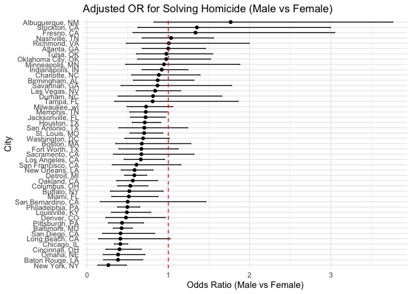
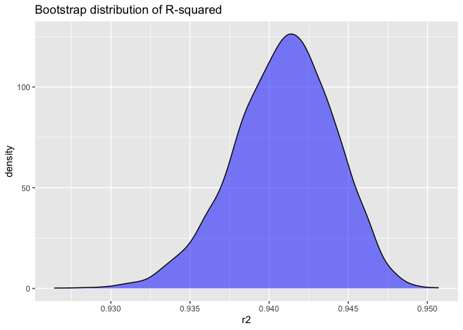
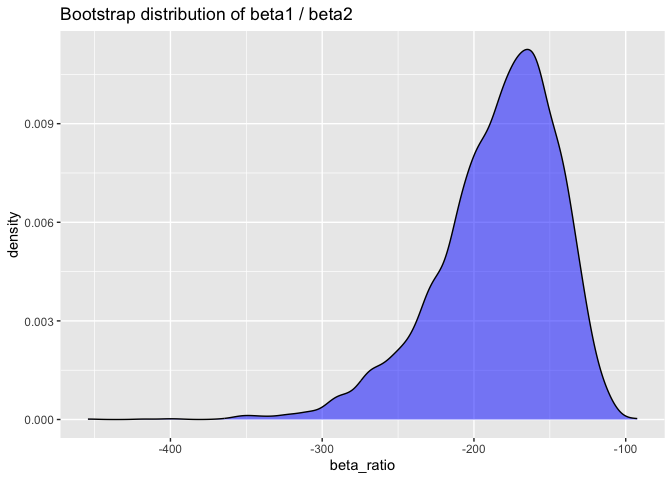
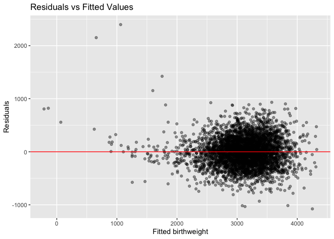
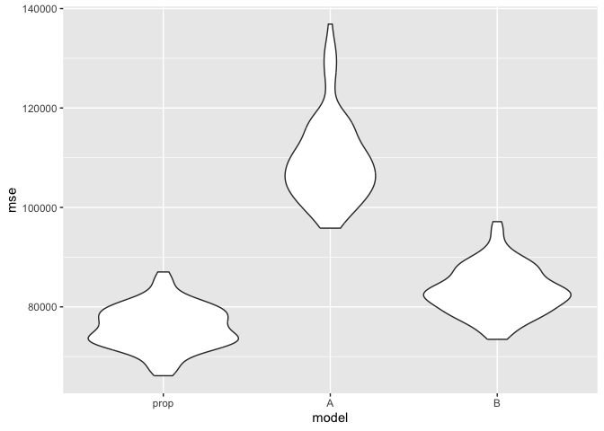

p8105_hw6_zz3460
================
Zihan Zhou
2025-11-17

## Problem 1

Set seed and load key packages.

``` r
set.seed(2025)

library(tidyverse)
```

    ## ── Attaching core tidyverse packages ──────────────────────── tidyverse 2.0.0 ──
    ## ✔ dplyr     1.1.4     ✔ readr     2.1.5
    ## ✔ forcats   1.0.0     ✔ stringr   1.6.0
    ## ✔ ggplot2   4.0.0     ✔ tibble    3.3.0
    ## ✔ lubridate 1.9.4     ✔ tidyr     1.3.1
    ## ✔ purrr     1.2.0     
    ## ── Conflicts ────────────────────────────────────────── tidyverse_conflicts() ──
    ## ✖ dplyr::filter() masks stats::filter()
    ## ✖ dplyr::lag()    masks stats::lag()
    ## ℹ Use the conflicted package (<http://conflicted.r-lib.org/>) to force all conflicts to become errors

``` r
library(broom)
library(purrr)
library(readr)
```

Read in data and clean.

``` r
homi <- read_csv("data/homicide-data.csv")
```

    ## Rows: 52179 Columns: 12
    ## ── Column specification ────────────────────────────────────────────────────────
    ## Delimiter: ","
    ## chr (9): uid, victim_last, victim_first, victim_race, victim_age, victim_sex...
    ## dbl (3): reported_date, lat, lon
    ## 
    ## ℹ Use `spec()` to retrieve the full column specification for this data.
    ## ℹ Specify the column types or set `show_col_types = FALSE` to quiet this message.

``` r
homi_clean <- homi %>%
  janitor::clean_names() %>%
  mutate(
    city_state = str_c(city, state, sep = ", "),
    disposition = str_trim(disposition),
    solved = if_else(disposition == "Closed by arrest", 1L, 0L),
    victim_age = as.numeric(victim_age),
    victim_race = str_to_title(str_trim(victim_race)),
    victim_sex = str_to_title(str_trim(victim_sex))
  ) %>%
  filter(
    !(city_state %in% c("Dallas, TX", "Phoenix, AZ", "Kansas City, MO", "Tulsa, AL")), 
    victim_race %in% c("White", "Black")                                               
  )
```

    ## Warning: There was 1 warning in `mutate()`.
    ## ℹ In argument: `victim_age = as.numeric(victim_age)`.
    ## Caused by warning:
    ## ! NAs introduced by coercion

``` r
glimpse(homi_clean)
```

    ## Rows: 39,693
    ## Columns: 14
    ## $ uid           <chr> "Alb-000003", "Alb-000005", "Alb-000006", "Alb-000009", …
    ## $ reported_date <dbl> 20100601, 20100102, 20100126, 20100130, 20100218, 201003…
    ## $ victim_last   <chr> "SATTERFIELD", "MULA", "BOOK", "MARTIN-LEYVA", "LUJAN", …
    ## $ victim_first  <chr> "VIVIANA", "VIVIAN", "GERALDINE", "GUSTAVO", "KEVIN", "S…
    ## $ victim_race   <chr> "White", "White", "White", "White", "White", "White", "W…
    ## $ victim_age    <dbl> 15, 72, 91, 56, NA, 43, 52, 22, 15, 25, 20, 88, 36, 47, …
    ## $ victim_sex    <chr> "Female", "Female", "Female", "Male", "Male", "Female", …
    ## $ city          <chr> "Albuquerque", "Albuquerque", "Albuquerque", "Albuquerqu…
    ## $ state         <chr> "NM", "NM", "NM", "NM", "NM", "NM", "NM", "NM", "NM", "N…
    ## $ lat           <dbl> 35.08609, 35.13036, 35.15111, 35.07538, 35.07701, 35.070…
    ## $ lon           <dbl> -106.6956, -106.5810, -106.5378, -106.5535, -106.5649, -…
    ## $ disposition   <chr> "Closed without arrest", "Closed without arrest", "Open/…
    ## $ city_state    <chr> "Albuquerque, NM", "Albuquerque, NM", "Albuquerque, NM",…
    ## $ solved        <int> 0, 0, 0, 0, 0, 1, 1, 1, 1, 1, 1, 0, 0, 0, 1, 1, 1, 1, 1,…

``` r
count(homi_clean, city_state) %>% arrange(desc(n)) %>% head()
```

    ## # A tibble: 6 × 2
    ##   city_state           n
    ##   <chr>            <int>
    ## 1 Chicago, IL       4507
    ## 2 Baltimore, MD     2753
    ## 3 Philadelphia, PA  2615
    ## 4 Detroit, MI       2457
    ## 5 Houston, TX       1887
    ## 6 St. Louis, MO     1645

Fit a logistic regression for Baltimore.

``` r
baltimore <- homi_clean %>% filter(city_state == "Baltimore, MD")

balt_model <- glm(solved ~ victim_age + victim_sex + victim_race, data = baltimore, family = binomial())
balt_tidy <- tidy(balt_model, conf.int = TRUE, exponentiate = TRUE)

balt_OR_row <- balt_tidy %>% filter(term == "victim_sexMale")
balt_OR_row
```

    ## # A tibble: 1 × 7
    ##   term           estimate std.error statistic  p.value conf.low conf.high
    ##   <chr>             <dbl>     <dbl>     <dbl>    <dbl>    <dbl>     <dbl>
    ## 1 victim_sexMale    0.426     0.138     -6.18 6.26e-10    0.324     0.558

Fit models by city robustly, extract OR and CI for male vs female

``` r
city_summary <- homi_clean %>%
  nest(data = -city_state) %>%
  mutate(
    fit = map(data, function(df) {
      glm(solved ~ victim_sex + victim_age + victim_race, 
          data = df, 
          family = binomial)
    }),
    tidied = map(fit, ~tidy(., conf.int = TRUE, exponentiate = TRUE))
  ) %>% 
  unnest(tidied) %>% 
  select(-data, -fit)
```

    ## Warning: There were 43 warnings in `mutate()`.
    ## The first warning was:
    ## ℹ In argument: `tidied = map(fit, ~tidy(., conf.int = TRUE, exponentiate =
    ##   TRUE))`.
    ## Caused by warning:
    ## ! glm.fit: fitted probabilities numerically 0 or 1 occurred
    ## ℹ Run `dplyr::last_dplyr_warnings()` to see the 42 remaining warnings.

``` r
or_by_city <- city_summary %>%
  filter(term == "victim_sexMale") %>%
  select(city_state, estimate, conf.low, conf.high, p.value) %>%
  arrange(estimate)

summary(or_by_city)
```

    ##   city_state           estimate         conf.low        conf.high     
    ##  Length:47          Min.   :0.2624   Min.   :0.1328   Min.   :0.4850  
    ##  Class :character   1st Qu.:0.4983   1st Qu.:0.3079   1st Qu.:0.8212  
    ##  Mode  :character   Median :0.6740   Median :0.3935   Median :1.0242  
    ##                     Mean   :0.7113   Mean   :0.4208   Mean   :1.2350  
    ##                     3rd Qu.:0.8685   3rd Qu.:0.5433   3rd Qu.:1.4603  
    ##                     Max.   :1.7675   Max.   :0.8247   Max.   :3.7619  
    ##     p.value        
    ##  Min.   :0.000000  
    ##  1st Qu.:0.004651  
    ##  Median :0.071763  
    ##  Mean   :0.258692  
    ##  3rd Qu.:0.503764  
    ##  Max.   :0.999683

``` r
knitr::kable(or_by_city)
```

| city_state         |  estimate |  conf.low | conf.high |   p.value |
|:-------------------|----------:|----------:|----------:|----------:|
| New York, NY       | 0.2623978 | 0.1327512 | 0.4850117 | 0.0000454 |
| Baton Rouge, LA    | 0.3814393 | 0.2043481 | 0.6836343 | 0.0016535 |
| Omaha, NE          | 0.3824861 | 0.1988357 | 0.7109316 | 0.0029514 |
| Cincinnati, OH     | 0.3998277 | 0.2313767 | 0.6670456 | 0.0006485 |
| Chicago, IL        | 0.4100982 | 0.3361233 | 0.5008546 | 0.0000000 |
| Long Beach, CA     | 0.4102163 | 0.1427304 | 1.0241775 | 0.0717631 |
| San Diego, CA      | 0.4130248 | 0.1913527 | 0.8301847 | 0.0172175 |
| Baltimore, MD      | 0.4255117 | 0.3241908 | 0.5575508 | 0.0000000 |
| Pittsburgh, PA     | 0.4307528 | 0.2626022 | 0.6955518 | 0.0006724 |
| Denver, CO         | 0.4790620 | 0.2327380 | 0.9624974 | 0.0410964 |
| Louisville, KY     | 0.4905546 | 0.3014879 | 0.7836391 | 0.0033700 |
| Philadelphia, PA   | 0.4962756 | 0.3760120 | 0.6498797 | 0.0000005 |
| San Bernardino, CA | 0.5003444 | 0.1655367 | 1.4623977 | 0.2056661 |
| Miami, FL          | 0.5152379 | 0.3040214 | 0.8734480 | 0.0134772 |
| Buffalo, NY        | 0.5205704 | 0.2884416 | 0.9358300 | 0.0289521 |
| Columbus, OH       | 0.5324845 | 0.3770457 | 0.7479124 | 0.0003039 |
| Oakland, CA        | 0.5630819 | 0.3637421 | 0.8671086 | 0.0093743 |
| Detroit, MI        | 0.5823472 | 0.4619454 | 0.7335458 | 0.0000045 |
| New Orleans, LA    | 0.5849373 | 0.4218807 | 0.8121787 | 0.0013105 |
| San Francisco, CA  | 0.6075362 | 0.3116925 | 1.1551470 | 0.1336164 |
| Los Angeles, CA    | 0.6618816 | 0.4565014 | 0.9541036 | 0.0279274 |
| Sacramento, CA     | 0.6688418 | 0.3262733 | 1.3143888 | 0.2548059 |
| Fort Worth, TX     | 0.6689803 | 0.3935128 | 1.1211603 | 0.1311687 |
| Boston, MA         | 0.6739912 | 0.3534469 | 1.2768225 | 0.2256969 |
| Washington, DC     | 0.6901713 | 0.4653608 | 1.0122516 | 0.0608080 |
| St. Louis, MO      | 0.7031665 | 0.5298505 | 0.9319005 | 0.0143877 |
| San Antonio, TX    | 0.7046200 | 0.3928179 | 1.2382509 | 0.2303369 |
| Houston, TX        | 0.7110264 | 0.5569844 | 0.9057376 | 0.0059322 |
| Jacksonville, FL   | 0.7198144 | 0.5359236 | 0.9650986 | 0.0283233 |
| Memphis, TN        | 0.7232194 | 0.5261210 | 0.9835973 | 0.0420463 |
| Milwaukee, wI      | 0.7271327 | 0.4951325 | 1.0542297 | 0.0976722 |
| Tampa, FL          | 0.8077029 | 0.3395253 | 1.8598834 | 0.6193928 |
| Durham, NC         | 0.8123514 | 0.3824420 | 1.6580169 | 0.5761077 |
| Las Vegas, NV      | 0.8373078 | 0.6058830 | 1.1510854 | 0.2776086 |
| Savannah, GA       | 0.8669817 | 0.4185827 | 1.7802453 | 0.6973523 |
| Birmingham, AL     | 0.8700153 | 0.5713814 | 1.3138409 | 0.5111455 |
| Charlotte, NC      | 0.8838976 | 0.5507440 | 1.3905954 | 0.6004077 |
| Indianapolis, IN   | 0.9187284 | 0.6784616 | 1.2413059 | 0.5818930 |
| Minneapolis, MN    | 0.9469587 | 0.4759016 | 1.8809745 | 0.8757279 |
| Oklahoma City, OK  | 0.9740747 | 0.6228507 | 1.5199721 | 0.9079362 |
| Tulsa, OK          | 0.9757694 | 0.6090664 | 1.5439356 | 0.9174584 |
| Atlanta, GA        | 1.0000771 | 0.6803477 | 1.4582575 | 0.9996829 |
| Richmond, VA       | 1.0060520 | 0.4834671 | 1.9936248 | 0.9865837 |
| Nashville, TN      | 1.0342379 | 0.6807452 | 1.5559966 | 0.8728884 |
| Fresno, CA         | 1.3351647 | 0.5672553 | 3.0475080 | 0.4963822 |
| Stockton, CA       | 1.3517273 | 0.6256427 | 2.9941299 | 0.4474507 |
| Albuquerque, NM    | 1.7674995 | 0.8247081 | 3.7618600 | 0.1392989 |

``` r
or_by_city %>%
  mutate(city_state = fct_reorder(city_state, estimate)) %>%
  ggplot(aes(x = city_state, y = estimate)) +
  geom_point() +
  geom_errorbar(aes(ymin = conf.low, ymax = conf.high), width = 0.2) +
  geom_hline(yintercept = 1, color = "red", linetype = "dashed") +
  coord_flip() +
  labs(title = "Adjusted OR for Solving Homicide (Male vs Female)", x = "City", y = "Odds Ratio (Male vs Female)") +
  theme_minimal()
```

<!-- -->

Interpretation of the Forest Plot

This forest plot displays the adjusted odds ratios (ORs) and 95%
confidence intervals (CIs) for solving homicides (male vs. female
victims) across cities, ordered by OR magnitude from lowest (top of the
plot) to highest (bottom of the plot).

The red dashed line at OR = 1 represents the “no difference” baseline:

- Cities with ORs and CIs entirely to the left of the baseline (e.g.,
  San Diego, CA and New York, NY) indicate female victims have
  statistically significantly higher odds of their homicides being
  solved than male victims.

- Most cities have CIs that cross the OR = 1 baseline, meaning there is
  no statistically significant difference in the odds of solving
  homicides between male and female victims in these locations.

Overall, while there is variation in ORs across cities, only a small
subset show statistically significant differences in the odds of solving
homicides by victim sex.

## Problem 2

Read in data and clean.

``` r
library(p8105.datasets)
data("weather_df")
wd <- weather_df %>% select(tmax, tmin, prcp) %>% drop_na()
```

Bootstrap

``` r
set.seed(2025)
B <- 5000
boot_results <- map_dfr(seq_len(B), function(i) {
  samp <- sample_n(wd, size = nrow(wd), replace = TRUE)
  fit <- lm(tmax ~ tmin + prcp, data = samp)
  r2 <- glance(fit)$r.squared
  td <- tidy(fit)
  beta_tmin <- td %>% filter(term == "tmin") %>% pull(estimate)
  beta_prcp <- td %>% filter(term == "prcp") %>% pull(estimate)
  tibble(r2 = r2, beta_ratio = beta_tmin / beta_prcp)
})
 
print(boot_results)
```

    ## # A tibble: 5,000 × 2
    ##       r2 beta_ratio
    ##    <dbl>      <dbl>
    ##  1 0.936      -221.
    ##  2 0.941      -172.
    ##  3 0.939      -218.
    ##  4 0.942      -170.
    ##  5 0.939      -203.
    ##  6 0.940      -198.
    ##  7 0.944      -169.
    ##  8 0.939      -195.
    ##  9 0.940      -179.
    ## 10 0.945      -228.
    ## # ℹ 4,990 more rows

Distribution and CI

``` r
ggplot(boot_results, aes(r2)) + geom_density(fill = "blue", alpha = 0.5) + labs(title = "Bootstrap distribution of R-squared")
```

<!-- -->

``` r
ggplot(boot_results, aes(beta_ratio)) + geom_density(fill = "blue", alpha = 0.5) + labs(title = "Bootstrap distribution of beta1 / beta2")
```

<!-- -->

## Bootstrap Distribution of $\hat{R}^2$

The bootstrap distribution for $\hat{R}^2$ is very tightly clustered,
with its peak at around 0.941. The distribution extends slightly to the
left, reaching a lower bound of roughly 0.930, and tops out near 0.950
on the upper end. These uniformly high values show that the model
captures about 93% to 95% of the variation in daily maximum temperature,
evidence of an extremely strong and reliable fit.

## Bootstrap Distribution of $\hat{\beta}_{\text{ratio}}$

The bootstrap distribution for $\hat{\beta}_{\text{ratio}}$ (the ratio
of the $t_{\text{tmin}}$ and $\text{prcp}$ coefficients) is roughly
unimodal, with a clear leftward skew and a central value of about -170.
Most of the estimates lie between -100 and -300, and every value in the
distribution is negative. This tells us that the two predictors act in
opposite directions. The pronounced left tail arises because, in some
bootstrap samples, the precipitation coefficient (the denominator of the
ratio) is near zero, making the ratio large and negative.

``` r
r2_CI <- quantile(boot_results$r2, c(0.025, 0.975))
beta_ratio_CI <- quantile(boot_results$beta_ratio, c(0.025, 0.975))

r2_CI
```

    ##      2.5%     97.5% 
    ## 0.9341324 0.9465590

``` r
beta_ratio_CI
```

    ##      2.5%     97.5% 
    ## -277.8610 -125.1789

The 95% confidence interval for $\hat{\beta}_{\text{ratio}}$ falls
between –277.8610 and –125.1789. Because this entire interval is
strictly negative and does not include zero, we conclude with 95%
confidence that the ratio of the coefficients is statistically
significant and negative. This indicates that the two predictors
consistently have effects in opposite directions (specifically, minimum
temperature has a positive effect while precipitation has a negative
effect).

The 95% confidence interval for $\hat{R}^2$ ranges from 0.934 to 0.947.
This narrow and high interval shows that the model is highly robust. We
can be 95% confident that the predictors explain between 93.4% and 94.7%
of the variation in maximum temperature, demonstrating strong and stable
predictive performance.

## Problem 3

Load and clean the data.

``` r
library(modelr)
```

    ## 
    ## Attaching package: 'modelr'

    ## The following object is masked from 'package:broom':
    ## 
    ##     bootstrap

``` r
library(rsample)
bw <- read_csv("data/birthweight.csv")
```

    ## Rows: 4342 Columns: 20

    ## ── Column specification ────────────────────────────────────────────────────────
    ## Delimiter: ","
    ## dbl (20): babysex, bhead, blength, bwt, delwt, fincome, frace, gaweeks, malf...
    ## 
    ## ℹ Use `spec()` to retrieve the full column specification for this data.
    ## ℹ Specify the column types or set `show_col_types = FALSE` to quiet this message.

``` r
bw_clean <- bw %>%
  janitor::clean_names() %>%
  mutate(
    babysex = as.factor(babysex),
    frace = as.factor(frace),
    mrace = as.factor(mrace),
    malform = as.factor(malform)
  ) %>%
  drop_na()

glimpse(bw_clean)
```

    ## Rows: 4,342
    ## Columns: 20
    ## $ babysex  <fct> 2, 1, 2, 1, 2, 1, 2, 2, 1, 1, 2, 1, 2, 1, 1, 2, 1, 2, 2, 2, 1…
    ## $ bhead    <dbl> 34, 34, 36, 34, 34, 33, 33, 33, 36, 33, 35, 35, 35, 36, 35, 3…
    ## $ blength  <dbl> 51, 48, 50, 52, 52, 52, 46, 49, 52, 50, 51, 51, 48, 53, 51, 4…
    ## $ bwt      <dbl> 3629, 3062, 3345, 3062, 3374, 3374, 2523, 2778, 3515, 3459, 3…
    ## $ delwt    <dbl> 177, 156, 148, 157, 156, 129, 126, 140, 146, 169, 130, 146, 1…
    ## $ fincome  <dbl> 35, 65, 85, 55, 5, 55, 96, 5, 85, 75, 55, 55, 75, 75, 65, 75,…
    ## $ frace    <fct> 1, 2, 1, 1, 1, 1, 2, 1, 1, 2, 1, 1, 1, 1, 1, 2, 1, 1, 1, 2, 1…
    ## $ gaweeks  <dbl> 39.9, 25.9, 39.9, 40.0, 41.6, 40.7, 40.3, 37.4, 40.3, 40.7, 4…
    ## $ malform  <fct> 0, 0, 0, 0, 0, 0, 0, 0, 0, 0, 0, 0, 0, 0, 0, 0, 0, 0, 0, 0, 0…
    ## $ menarche <dbl> 13, 14, 12, 14, 13, 12, 14, 12, 11, 12, 13, 12, 13, 11, 12, 1…
    ## $ mheight  <dbl> 63, 65, 64, 64, 66, 66, 72, 62, 61, 64, 67, 62, 64, 68, 62, 6…
    ## $ momage   <dbl> 36, 25, 29, 18, 20, 23, 29, 19, 13, 19, 23, 16, 28, 23, 21, 1…
    ## $ mrace    <fct> 1, 2, 1, 1, 1, 1, 2, 1, 1, 2, 1, 1, 1, 1, 1, 2, 1, 1, 1, 2, 1…
    ## $ parity   <dbl> 3, 0, 0, 0, 0, 0, 0, 0, 0, 0, 0, 0, 0, 0, 0, 0, 0, 0, 0, 0, 0…
    ## $ pnumlbw  <dbl> 0, 0, 0, 0, 0, 0, 0, 0, 0, 0, 0, 0, 0, 0, 0, 0, 0, 0, 0, 0, 0…
    ## $ pnumsga  <dbl> 0, 0, 0, 0, 0, 0, 0, 0, 0, 0, 0, 0, 0, 0, 0, 0, 0, 0, 0, 0, 0…
    ## $ ppbmi    <dbl> 26.27184, 21.34485, 23.56517, 21.84508, 21.02642, 18.60030, 1…
    ## $ ppwt     <dbl> 148, 128, 137, 127, 130, 115, 105, 119, 105, 145, 110, 115, 1…
    ## $ smoken   <dbl> 0.000, 0.000, 1.000, 10.000, 1.000, 0.000, 0.000, 0.000, 0.00…
    ## $ wtgain   <dbl> 29, 28, 11, 30, 26, 14, 21, 21, 41, 24, 20, 31, 23, 21, 24, 2…

My model

Description:

I first identified predictors based on domain knowledge—fetal growth
indicators (blength, bhead, gaweeks) are directly linked to birthweight,
while maternal factors (babysex, momage, ppbmi, smoken, wtgain) and
demographic variables (frace, mrace) are known to influence fetal
development.

Then, I chose a linear regression model with bwt as the outcome,
including all selected variables to capture both fetal and maternal
effects.

Since the goal was to build a comprehensive model, I did not remove any
variables from my model.

``` r
prop_model <- lm(
  bwt ~ blength + bhead + gaweeks + babysex + momage + ppbmi + smoken + wtgain + frace + mrace,
  data = bw_clean
)

summary(prop_model)
```

    ## 
    ## Call:
    ## lm(formula = bwt ~ blength + bhead + gaweeks + babysex + momage + 
    ##     ppbmi + smoken + wtgain + frace + mrace, data = bw_clean)
    ## 
    ## Residuals:
    ##      Min       1Q   Median       3Q      Max 
    ## -1076.35  -186.92    -4.97   177.86  2396.94 
    ## 
    ## Coefficients:
    ##               Estimate Std. Error t value Pr(>|t|)    
    ## (Intercept) -5777.7233   102.8486 -56.177  < 2e-16 ***
    ## blength        76.5144     2.0202  37.875  < 2e-16 ***
    ## bhead         132.0819     3.4688  38.077  < 2e-16 ***
    ## gaweeks        11.0681     1.4695   7.532 6.06e-14 ***
    ## babysex2       32.0133     8.5093   3.762 0.000171 ***
    ## momage          1.9810     1.1721   1.690 0.091064 .  
    ## ppbmi           6.8455     1.3471   5.082 3.90e-07 ***
    ## smoken         -4.6503     0.5895  -7.888 3.85e-15 ***
    ## wtgain          4.1554     0.3967  10.474  < 2e-16 ***
    ## frace2         20.5278    46.3819   0.443 0.658090    
    ## frace3         18.2572    69.7358   0.262 0.793484    
    ## frace4        -51.5713    44.9330  -1.148 0.251140    
    ## frace8        -10.0018    74.4973  -0.134 0.893206    
    ## mrace2       -162.8886    46.3194  -3.517 0.000442 ***
    ## mrace3       -119.3665    72.2969  -1.651 0.098799 .  
    ## mrace4        -88.0532    45.2347  -1.947 0.051649 .  
    ## ---
    ## Signif. codes:  0 '***' 0.001 '**' 0.01 '*' 0.05 '.' 0.1 ' ' 1
    ## 
    ## Residual standard error: 274.3 on 4326 degrees of freedom
    ## Multiple R-squared:  0.7141, Adjusted R-squared:  0.7131 
    ## F-statistic: 720.3 on 15 and 4326 DF,  p-value: < 2.2e-16

``` r
bw_aug <- bw_clean %>%
  add_predictions(prop_model) %>%
  add_residuals(prop_model)

ggplot(bw_aug, aes(x = pred, y = resid)) +
  geom_point(alpha = 0.4) +
  geom_hline(yintercept = 0, color = "red") +
  labs(
    title = "Residuals vs Fitted Values",
    x = "Fitted birthweight",
    y = "Residuals"
  )
```

<!-- -->

The plot of model residuals against fitted values reveals that for the
majority of the data (central mass), the residuals are clustered around
zero, indicating that the model fits reasonably well for babies with
average birthweights. However, there is some evidence of non-linearity
or uncaptured variance at lower predicted birthweights, where residuals
tend to be positive. This suggests the model may slightly underpredict
the weight of smaller babies or that other factors are influencing low
birthweight outcomes.

Comparation with two other models

``` r
model_A <- lm(bwt ~ blength + gaweeks, data = bw_clean)

model_B <- lm(
  bwt ~ bhead * blength * babysex,
  data = bw_clean
)

set.seed(123)

cv_data <- crossv_mc(bw_clean, 100) %>%
  mutate(
    train = map(train, as_tibble),
    test = map(test, as_tibble)
  )

cv_results <- cv_data %>%
  mutate(
    fit_prop  = map(train, ~ lm(bwt ~ blength + bhead + gaweeks + babysex + momage + ppbmi + smoken + wtgain + frace + mrace, data = .x)),
    fit_A     = map(train, ~ lm(bwt ~ blength + gaweeks, data = .x)),
    fit_B     = map(train, ~ lm(bwt ~ bhead * blength * babysex, data = .x)),
    mse_prop  = map2_dbl(fit_prop, test,  ~ mean((predict(.x, .y) - .y$bwt)^2)),
    mse_A     = map2_dbl(fit_A,    test,  ~ mean((predict(.x, .y) - .y$bwt)^2)),
    mse_B     = map2_dbl(fit_B,    test,  ~ mean((predict(.x, .y) - .y$bwt)^2))
  )

cv_summary <- cv_results %>%
  summarise(
    MSE_prop = mean(mse_prop),
    MSE_A    = mean(mse_A),
    MSE_B    = mean(mse_B)
  )

cv_summary
```

    ## # A tibble: 1 × 3
    ##   MSE_prop   MSE_A  MSE_B
    ##      <dbl>   <dbl>  <dbl>
    ## 1   75874. 109527. 83233.

``` r
cv_results %>% 
  select(starts_with("mse")) |> 
  pivot_longer(
    everything(),
    names_to = "model", 
    values_to = "mse",
    names_prefix = "mse_"
  ) |> 
  mutate(model = fct_inorder(model)) |> 
  ggplot(aes(x = model, y = mse)) + 
  geom_violin()
```

<!-- -->

The cross-validated MSE results show that prop_model has the lowest mean
MSE (75,874.16), followed by model_B (83,233.12) and model_A
(109,526.6). This indicates that the custom prop_model—which includes
fetal measurements, maternal characteristics, and demographic
factors—has the best prediction performance.

model_A (only blength and gaweeks) performs the worst, as it lacks key
predictors. model_B (with interactions between bhead, blength, and
babysex) improves over model_A but is less effective than prop_model,
likely because it does not account for maternal factors like smoking or
BMI.

The violin plot further confirms these trends: prop_model has the
tightest and lowest MSE distribution, while model_A has the widest and
highest distribution.
